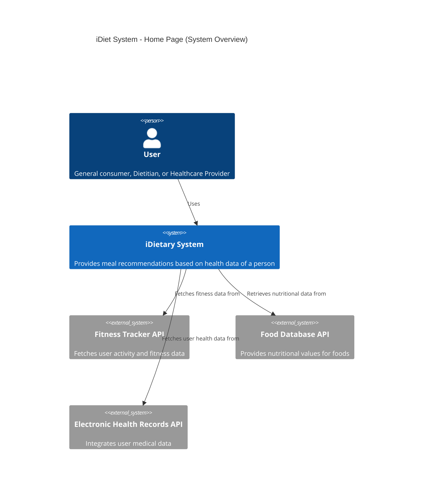

```mermaid
C4Context
  title iDiet System - Home Page (System Overview)
  Person(user, "User", "General consumer,  Dietitian, or Healthcare Provider")
  System(dietarySystem, "iDietary System", "Provides meal recommendations based on health data of a person")
  System_Ext(fitnessTracker, "Fitness Tracker API", "Fetches user activity and fitness data")
  System_Ext(foodDatabase, "Food Database API", "Provides nutritional values for foods")
  System_Ext(healthRecords, "Electronic Health Records API", "Integrates user medical data")
  
  Rel(user, dietarySystem, "Uses")
  Rel(dietarySystem, fitnessTracker, "Fetches fitness data from")
  Rel(dietarySystem, foodDatabase, "Retrieves nutritional data from")
  Rel(dietarySystem, healthRecords, "Fetches user health data from")
```
