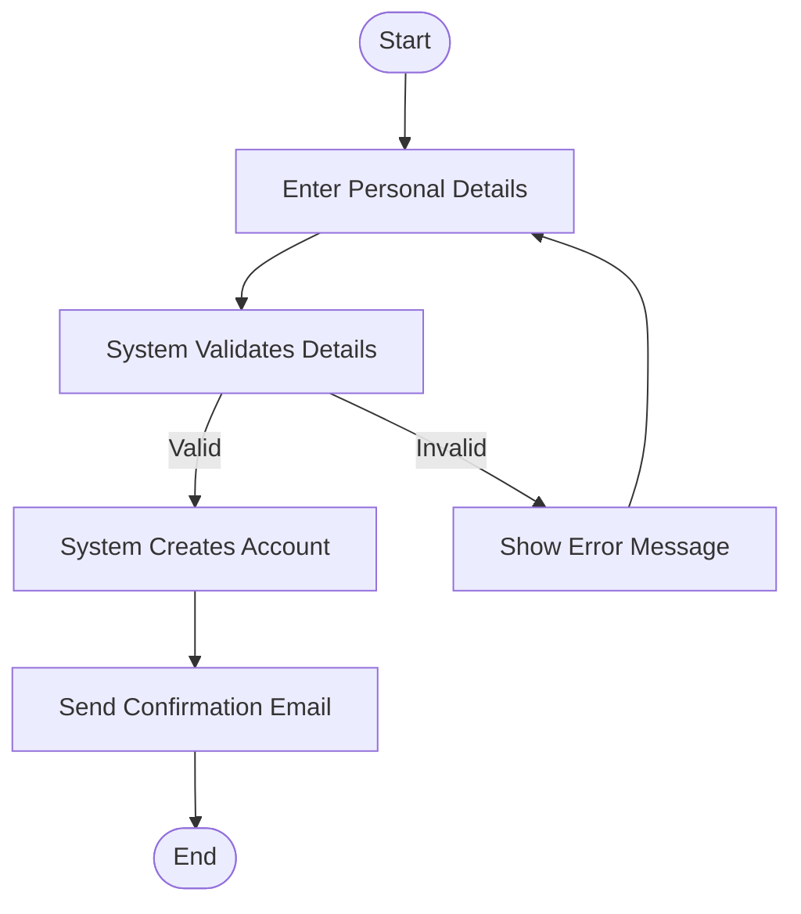
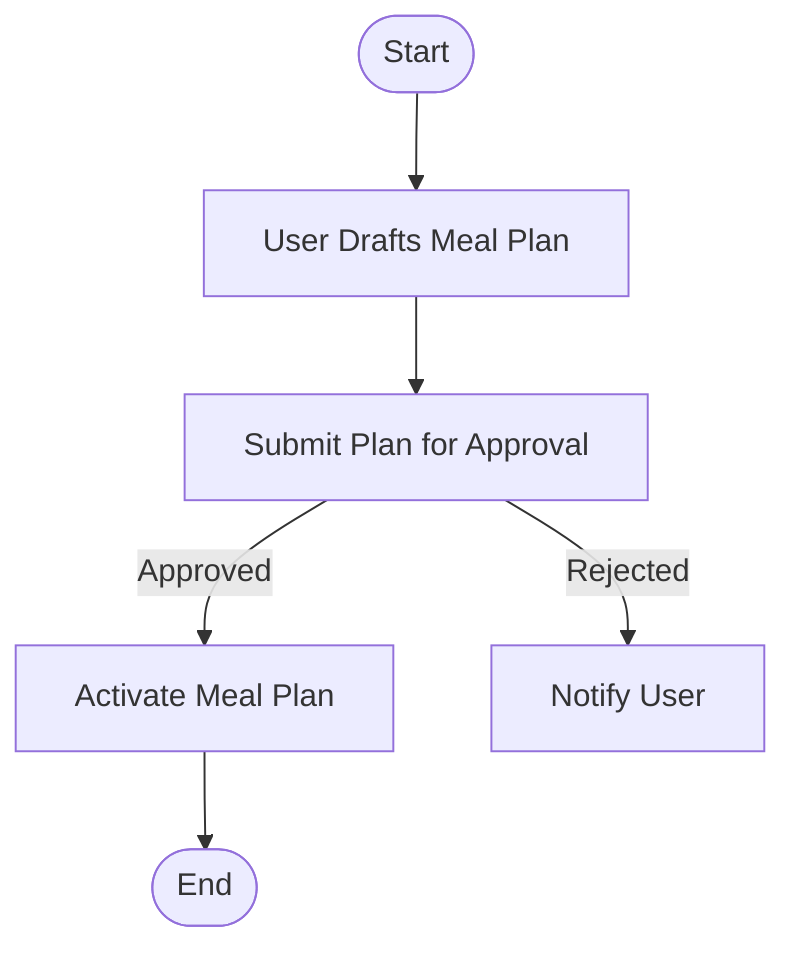
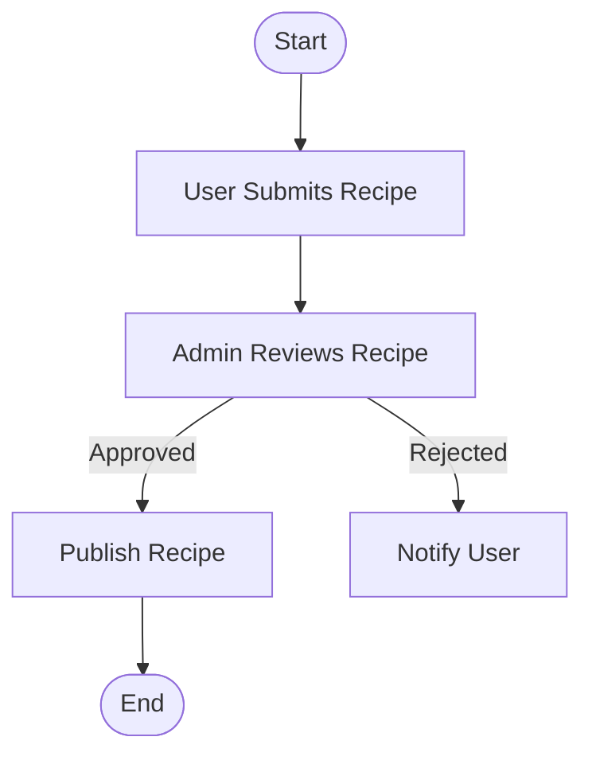
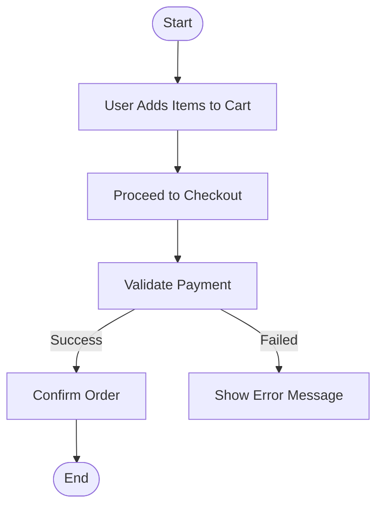
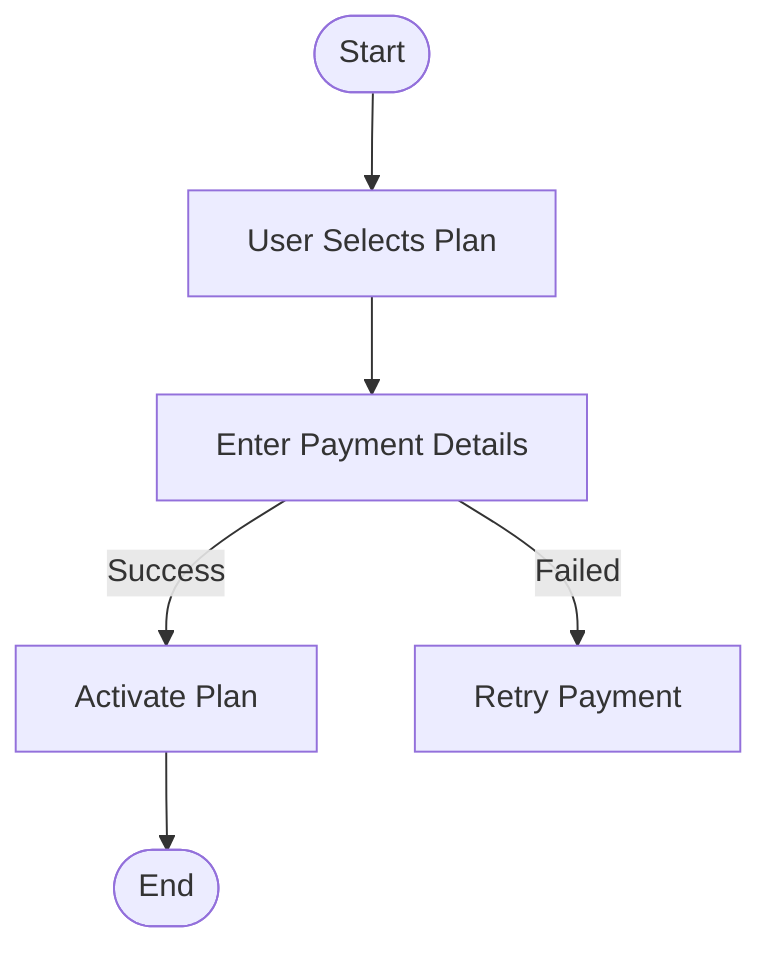
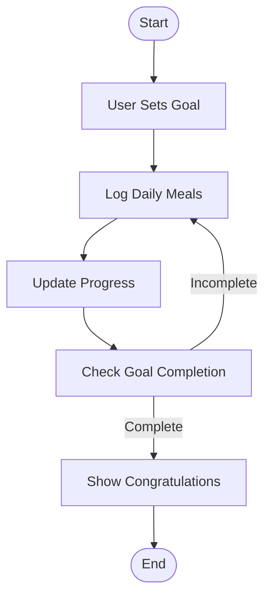
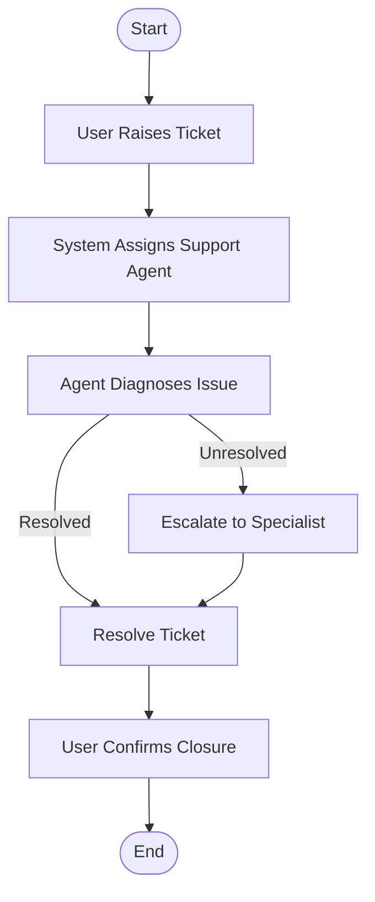
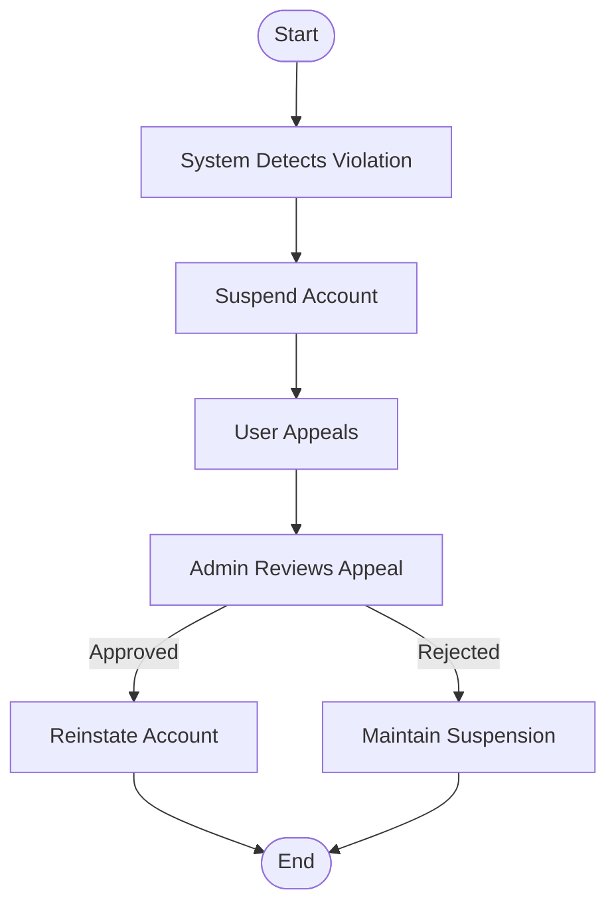

# Activity Workflow Modeling for iDiet System

## 1. User Registration

**Explanation:** This workflow addresses stakeholder concerns regarding data integrity and user experience by ensuring input validation and feedback during account creation.

## 2. Meal Plan Creation

**Explanation:** The process ensures all plans meet system standards through admin review, aligning with dietary regulation policies.

## 3. Recipe Submission and Approval

**Explanation:** Recipes undergo admin moderation, ensuring content quality and safety before publication.

## 4. Place Order

**Explanation:** Streamlines ordering with integrated payment validation, addressing concerns of transaction errors.

## 5. Subscription Management

**Explanation:** Simplifies onboarding for premium services while ensuring secure and validated payment flows.

## 6. Progress Tracking

**Explanation:** Motivates users through goal-based tracking, fostering healthy habits and accountability.

## 7. Support Ticket Process

**Explanation:** Ensures responsive user support and accountability, supporting user satisfaction and issue resolution.

## 8. Account Suspension and Reinstatement

**Explanation:** Reinforces community standards while ensuring fair appeal and resolution, aligning with policy enforcement needs.

