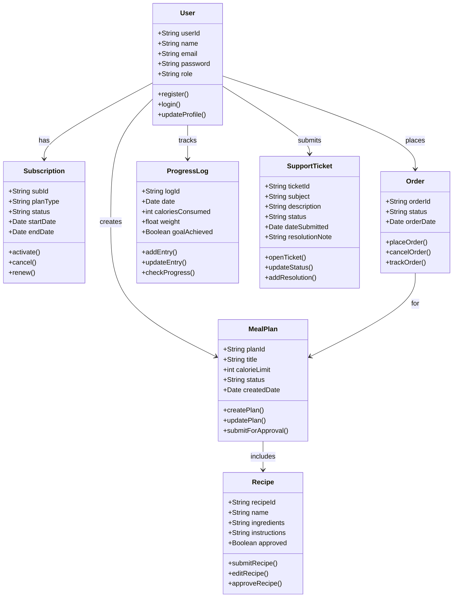

## Task 2: Class Diagram (30 Marks)

### Explanation:
This class diagram captures the core structure of the iDiet system and its relationships:
- The **User** entity is central, connected to MealPlans, Orders, Subscriptions, SupportTickets, and ProgressLogs.
- A **MealPlan** can contain multiple **Recipes**, which must be approved before inclusion.
- Each **Order** is placed by a User for a MealPlan.
- Subscriptions and logs ensure service control and health tracking.
- SupportTickets help manage user support within the system.

Each class includes both attributes and key behavioral methods, aligning with domain logic and Agile requirements.

Let me know when you’d like to proceed to Task 3: System Sequence Diagram (SSD).
