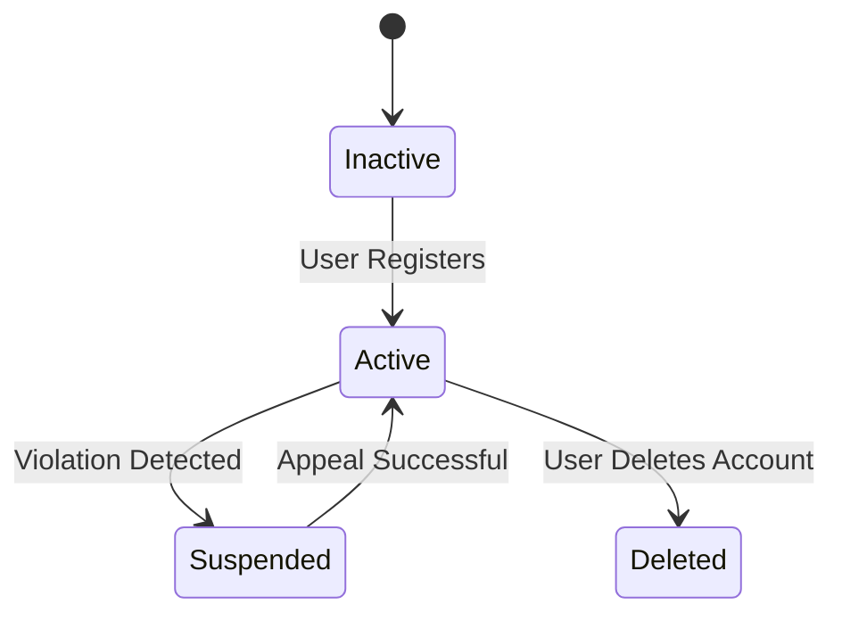
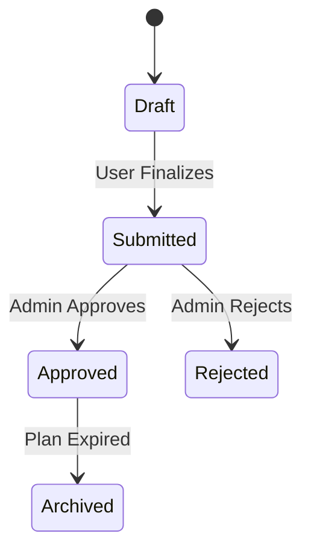
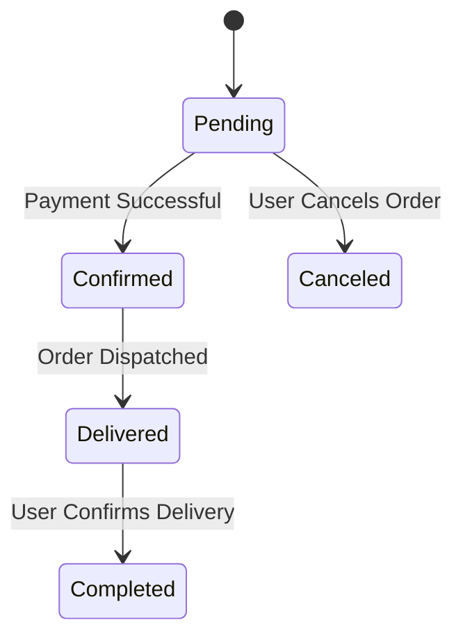
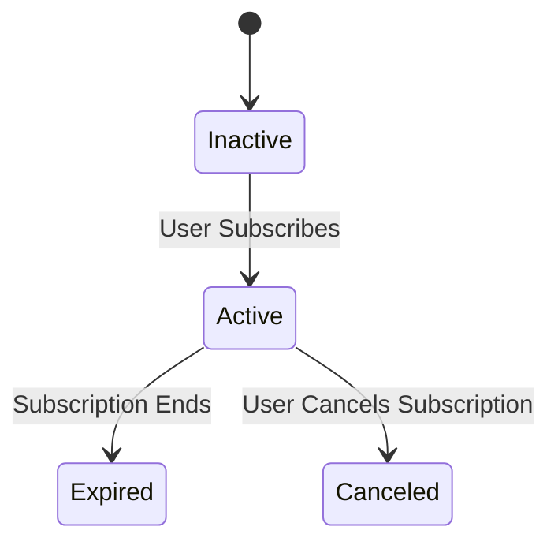
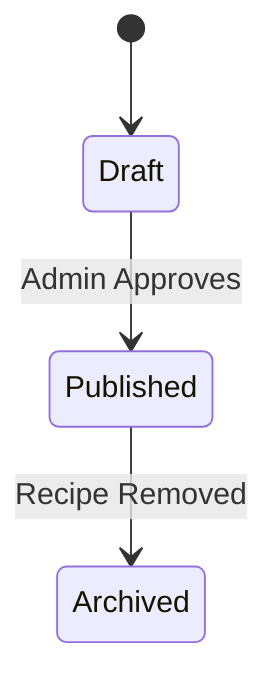
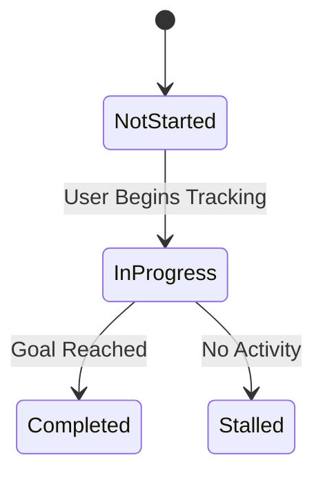
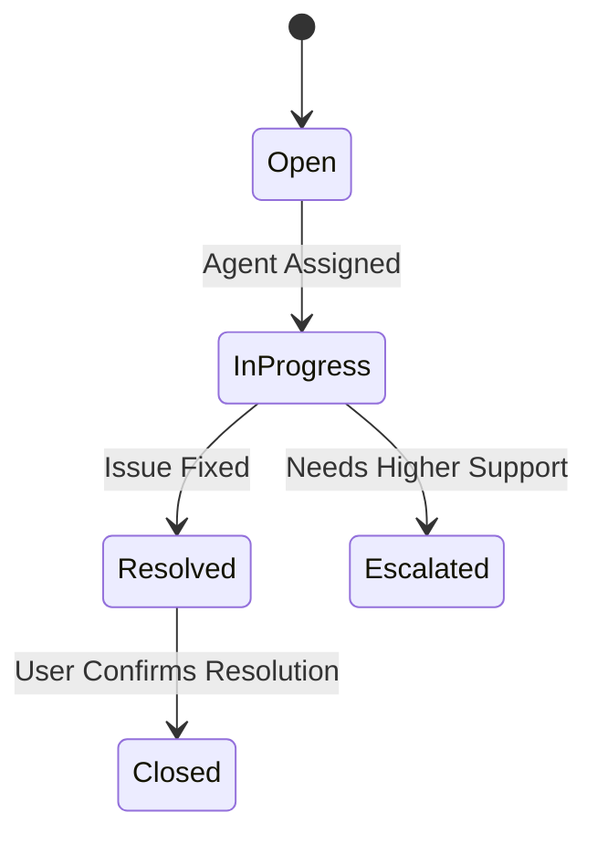

# Object-State Modeling

This section presents state transition diagrams for critical objects in the iDiet system. It also provides a diagram to show how objects transition between states based on system events and interactions, ensuring alignment with functional requirements and use cases.

# Object State Modeling with State Transition Diagrams

## 1. User Account State Diagram

**Explanation:**
The User Account transitions from an Inactive state upon registration. If a violation is detected(any suspicious event), the account moves to Suspended, which can be reactivated upon a successful appeal. Users can also deactivate their accounts, leading to the Deleted state.

## 2. Meal Plan State Diagram

**Explanation:**
Meal plans start in the Draft state and are Submitted when finalized by the user. A system admin reviews the plan, either Approving or Rejecting it. Once an approved meal plan expires, it moves to Archived status.

## 3. Order State Diagram

**Explanation:**
Orders start as Pending and move to Confirmed after a successful payment. Once dispatched, they transition to Delivered and then Completed upon user confirmation. If a user cancels before confirmation, the order moves to Canceled.

## 4. Subscription State Diagram

**Explanation:**
All Subscriptions remain Inactive until a user subscribes, moving them to Active. If the subscription period ends, it transitions to Expired. If the user manually cancels, the subscription moves to Canceled.

## 5. Recipe State Diagram

**Explanation:**
Recipes begin as Drafts, and after admin approval, they transition to Published. If removed from the system, they enter the Archived state.

## 6. Progress Tracking State Diagram

**Explanation:**
Users start tracking progress in NotStarted mode. When they begin, it moves to InProgress. If no activity is detected, it transitions to Stalled. Upon reaching their goal, it moves to Completed.

## 7. Support Ticket State Diagram

**Explanation:**
Support tickets begin as Open. When assigned to an agent, they move to InProgress. If resolved, they transition to Resolved, and once confirmed by the user, they are Closed. If complex, they may be Escalated.

## Explanation
Each state diagram represents the lifecycle of a key object within the iDiet system. 
- The **User Account** diagram ensures compliance with registration and account management.
- The **Meal Plan** and **Recipe** diagrams handle content approval and management workflows.
- The **Order** and **Subscription** diagrams align with purchase and usage flows.
- **Progress Tracking** ensures users can monitor their fitness journey effectively.
- The **Support Ticket** diagram maps to system interactions for issue resolution.

These diagrams align with functional requirements by defining state transitions necessary for smooth system operation.

