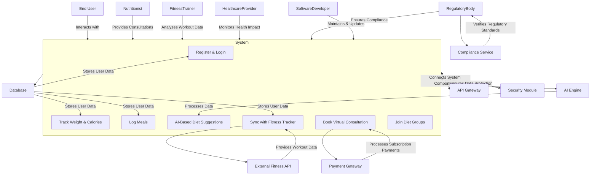

# Explanation of the Use Case Diagram
## Key Actors and Their Roles

**End Users** – Primary users who track weight, log meals, receive diet suggestions, and engage in community features.

**Nutritionists** – Experts providing consultations, validating meal plans, and ensuring AI-based diet suggestions align with health standards.

**Fitness Trainers** – Assist users by recommending workout routines and ensuring fitness-tracking data is effectively utilized.

**Software Developers** – Maintain system functionality, update AI recommendations, and ensure seamless performance.

**Healthcare Providers** – Oversee the medical impact of dietary plans, ensuring safe weight management for users.

**Regulatory Bodies** – Are the to ensure there's compliance with dietary and health regulations, overseeing AI ethics and data security.

## Relationships Between Actors and Use Cases

**Generalization:** Both Nutritionists and Healthcare Providers influence dietary recommendations and ensure medical compliance.

**Inclusion:** Logging meals includes barcode scanning to simplify user input. AI-based diet suggestions rely on weight tracking and meal logging.

**Association:** Users interact with most functions, while specialized roles validate or enhance the system.

## Addressing Stakeholder Concerns

**Personalization & Accuracy:** AI-driven meal plans adapt to individual users, validated by nutritionists and healthcare providers.

**Usability & Engagement:** Gamification and social diet groups increase motivation for end users.

**Security & Compliance:** Regulatory bodies ensure data security and AI compliance.

